# Internee.pk-Intern-Task-Management-System-UI
Complete UI/UX design for the Intern Management System including dashboard pages, task management screens, analytics views, light & dark modes, reusable components, and interactive prototype.

---

## Main Dashboard (Light Mode)
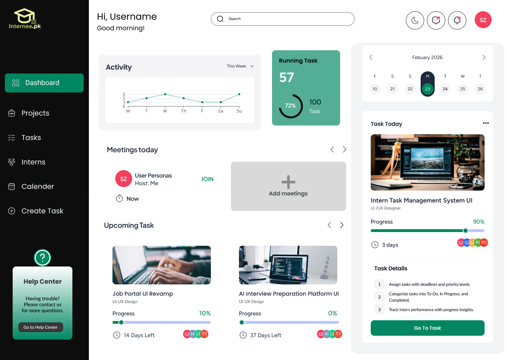

---

## Task Status (Light Mode)
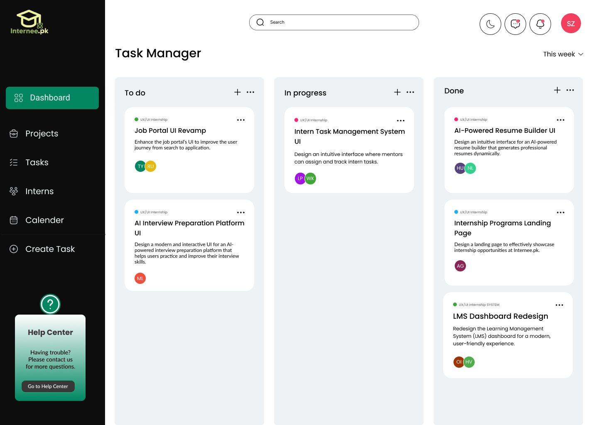

---

## Task Assign (Light Mode)
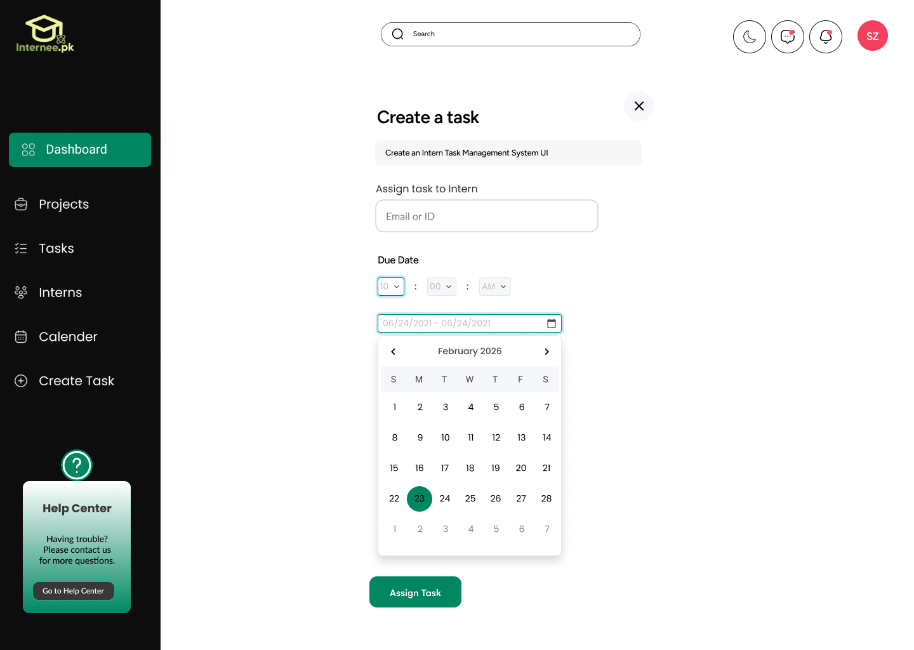

---

## Task Priority (Light Mode)
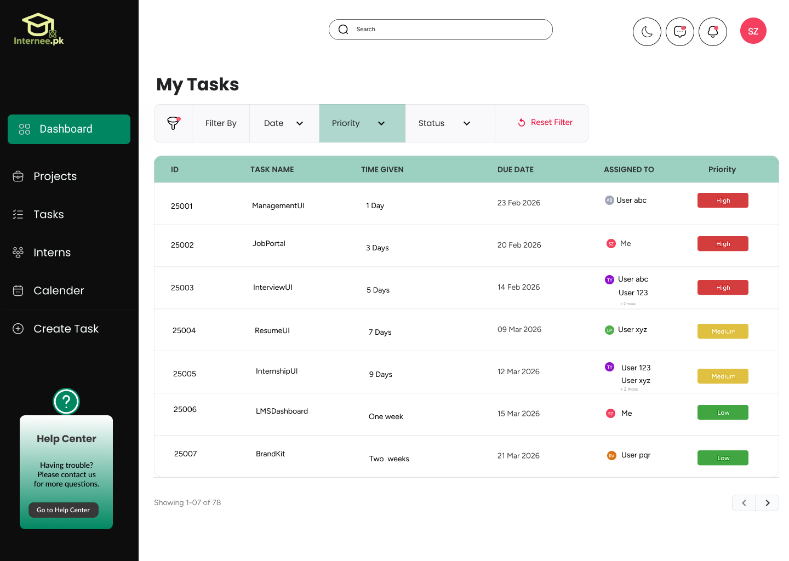

---

## Intern Search (Light Mode)
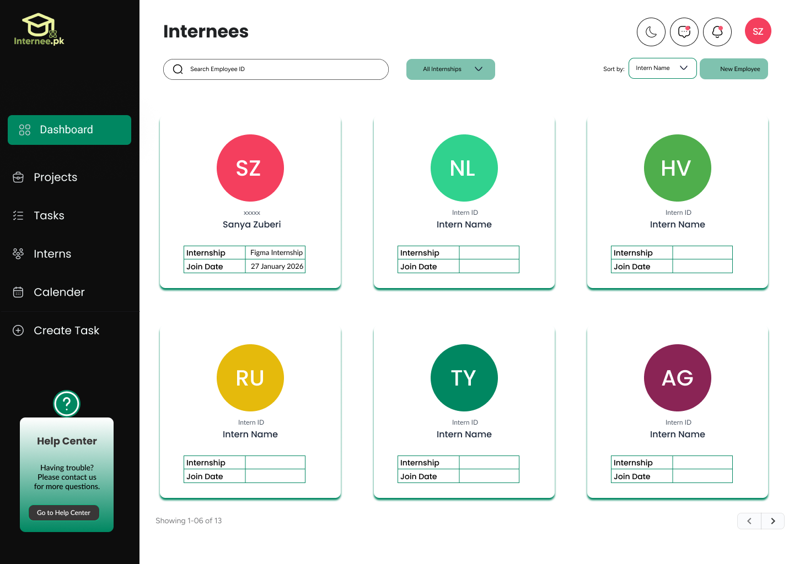

---

## Intern Analytics (Light Mode)
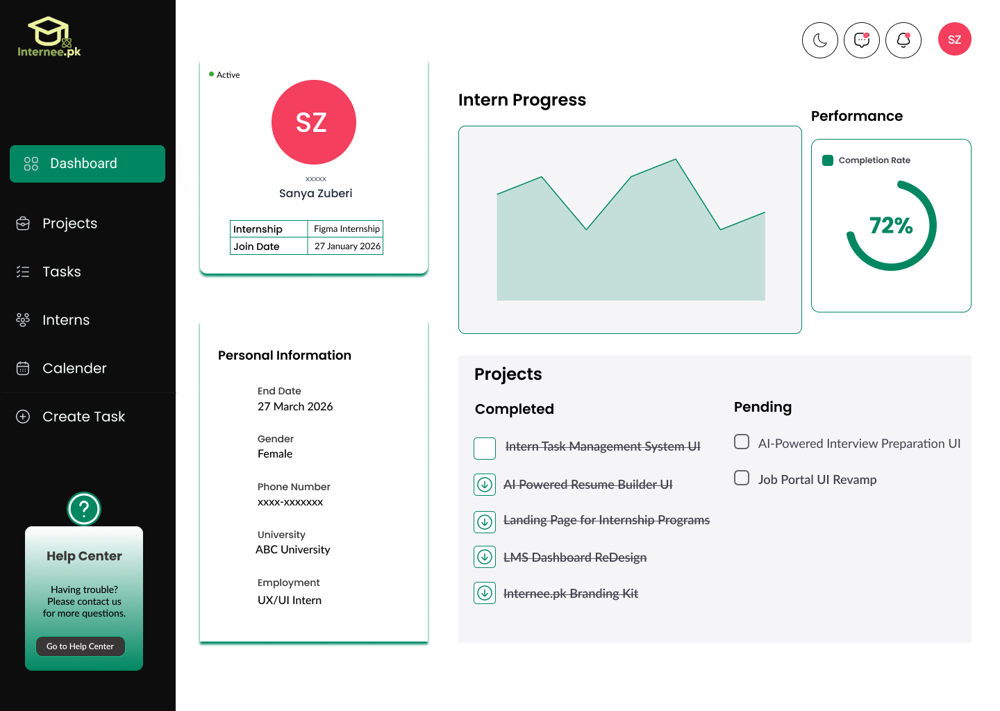

---

## Main Dashboard (Dark Mode)
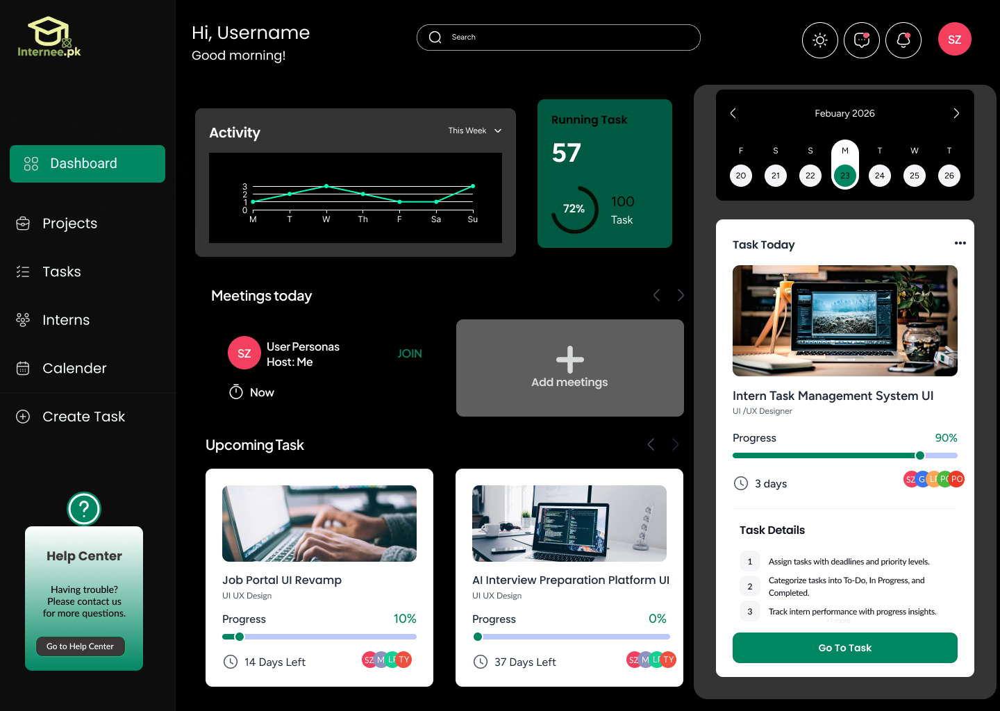

---

## Task Status (Dark Mode)
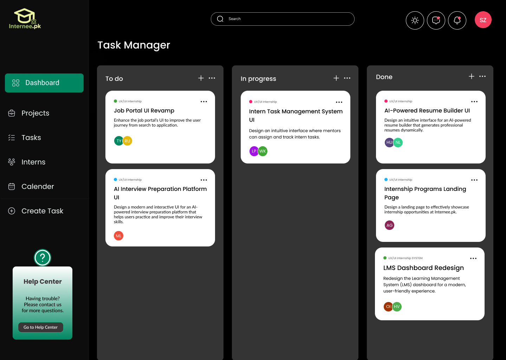

---

## Task Assign (Dark Mode)
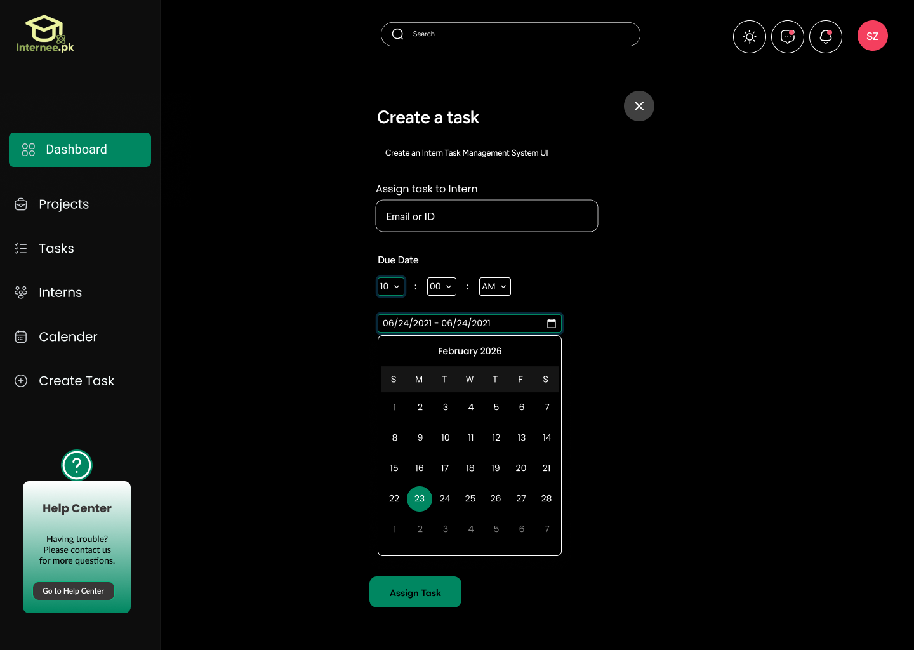

---

## Task Priority (Dark Mode)
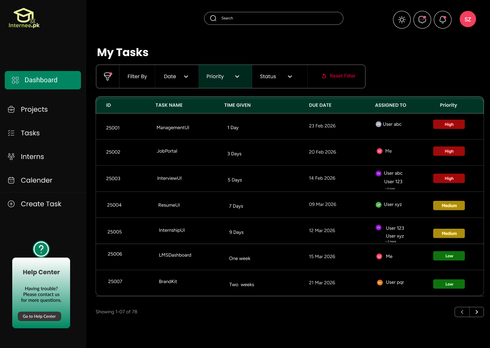

---

## Intern Search (Dark Mode)
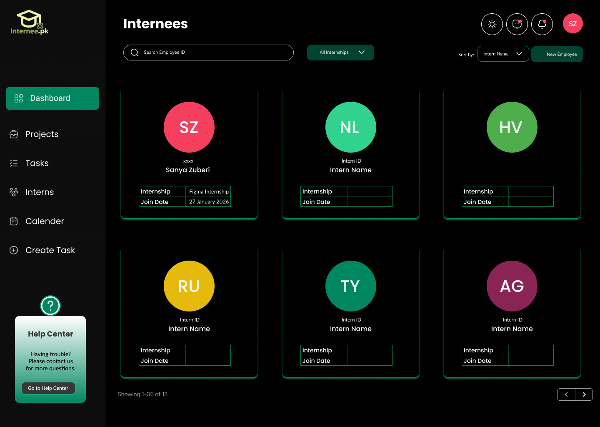

---

## Intern Analytics (Dark Mode)
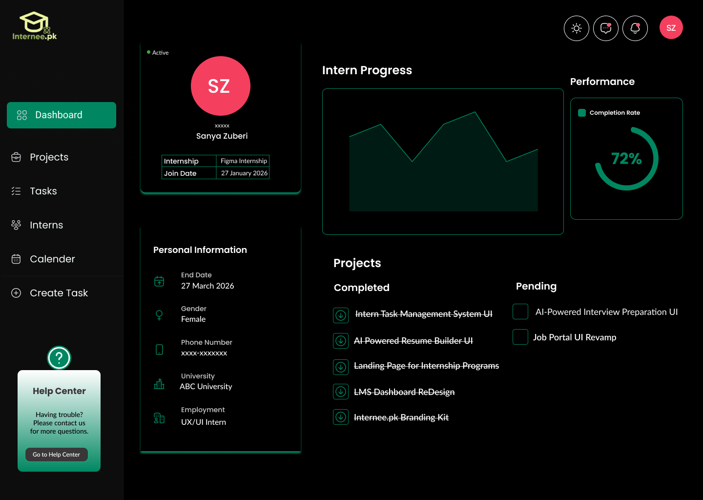

---

## Components
Reusable UI components built with Auto Layout and structured variants for scalability and theme consistency.

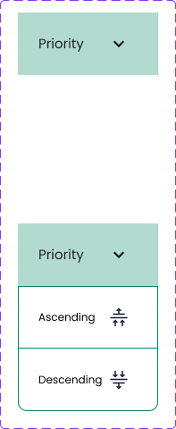
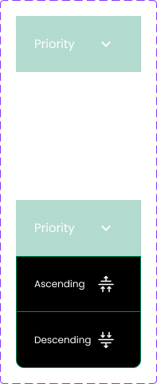

---

[View Full Figma Prototype](https://www.figma.com/proto/4cwoRJXtFUiitiOI63t94o/Intern-Task-Management-System-UI?node-id=3015-1730&t=wDbcWo4scZUtIn1u-1&scaling=scale-down&content-scaling=fixed&page-id=0%3A1&starting-point-node-id=3015%3A1730) 

